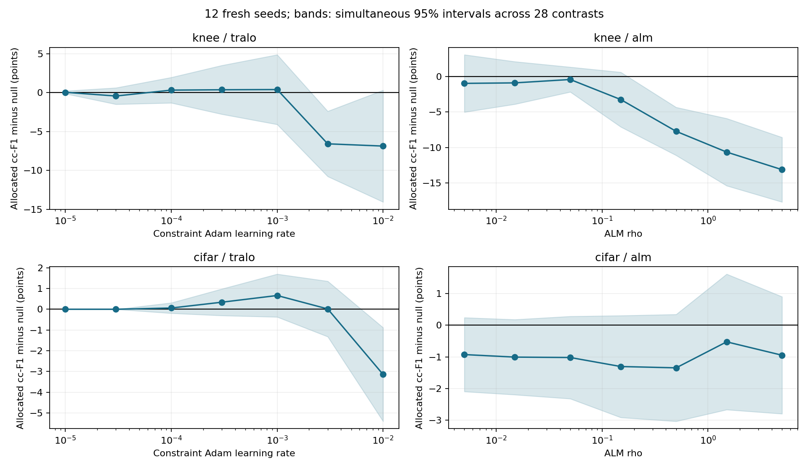

# Constraint-strength sweep: 384 fits, 12 fresh seeds

All planned runs completed and passed the execution/metric/hash audits. The 12 new seeds (1001-1012) are separate from the earlier four seeds. Runtime math is unchanged; this study varies only TraLO constraint learning rate or ALM rho.

Both datasets use frozen ImageNet ResNet18 features, 20 head epochs, 5 warmup, task Adam .001. Knee: 5778 training/826 development images. CIFAR100: fixed 10000/2000 training/development subset. All runs use Quadro FP32 on dsisco01. Neither test set was scored. These are repeatedly inspected development splits, not untouched confirmation data.

cc-F1 means mean F1 over constrained classes. The main comparison fills identical capped slots: knee grades3/4 =82/16; CIFAR classes0-9 =10 each. Uncapped classes remain unrestricted. Common null is TraLO Null = ALM Null under this schedule; we run it once per seed.

All 28 primary setting-versus-null comparisons belong to one Holm-corrected family. The table also reports Bonferroni simultaneous 95% intervals across those 28 comparisons. These describe training-seed variation on fixed splits; they do not establish population generalization. Wins/ties/losses count paired seed differences.

## What changed in our understanding

The earlier four-seed picture did not reproduce as a narrow .0001 optimum.
On twelve fresh seeds, knee TraLO-minus-null means are +0.327 at .0001,
+0.371 at .0003 and +0.399 at .001. The earlier roughly two-point fall between
.0001 and .001 is absent in this cohort. That is evidence of sensitivity to the
small initial seed sample, not evidence of a sharply determined optimum.

At .0001, knee wins/ties/losses are 3/8/1; CIFAR is 1/11/0. These are ties in
constrained-class F1, NOT necessarily identical predictions. Direct saved-label
comparison finds exactly identical full allocated predictions in only1/12 knee
and4/12 CIFAR runs. Small steps often change too few useful assignments to create
a clear metric advantage; this is a measured outcome, not proof the gradient is0.

None of the28 primary contrasts is significantly positive after Holm correction.
Stronger interventions can be reliably harmful: knee TraLO .003, CIFAR TraLO
.01, and knee ALM rho .5/1.5/5 have negative Holm-adjusted results. Other negative
means do not automatically establish harm after correction. All seven ALM
strengths have negative mean differences on both datasets; that does not prove
all ALM variants or training budgets fail.

This supports a stronger, narrower conclusion: in this fixed-feature setup,
scalar constraint strength tuning has not established a useful gain. There is
a relatively flat/noisy low-strength range and harmful stronger regimes, rather
than a demonstrated winning sweet spot. We should next isolate update schedule
from objective shape, and eventually test constraints during backbone training;
this sweep trained only the linear head and cannot answer that latter question.
Those next experiments have not been run here. Do not continue extending this
grid until a favorable p-value appears.

## knee

| Method | Allocated accuracy | Allocated macro-F1 | Allocated cc-F1 | Raw feasible seeds |
|---|---:|---:|---:|---:|
| alm_0.005 | 49.516 | 38.087 | 39.954 | 11/12 |
| alm_0.015 | 49.586 | 38.146 | 40.027 | 12/12 |
| alm_0.05 | 49.657 | 38.290 | 40.503 | 12/12 |
| alm_0.15 | 49.374 | 37.067 | 37.673 | 12/12 |
| alm_0.5 | 48.880 | 35.010 | 33.188 | 12/12 |
| alm_1.5 | 48.386 | 33.442 | 30.258 | 12/12 |
| alm_5 | 47.952 | 31.977 | 27.777 | 12/12 |
| clipper | 49.385 | 37.961 | 39.987 | 8/12 |
| tralo_0.0001 | 49.607 | 38.643 | 41.239 | 8/12 |
| tralo_0.0003 | 49.596 | 38.638 | 41.283 | 11/12 |
| tralo_0.001 | 49.869 | 38.894 | 41.311 | 12/12 |
| tralo_0.003 | 49.062 | 36.588 | 34.328 | 12/12 |
| tralo_0.01 | 48.325 | 36.159 | 34.038 | 12/12 |
| tralo_1e-05 | 49.536 | 38.473 | 40.956 | 6/12 |
| tralo_3e-05 | 49.526 | 38.310 | 40.480 | 7/12 |
| tralo_null | 49.546 | 38.477 | 40.912 | 6/12 |

| Setting vs common null | cc-F1 delta (points) | Paired SD | Simultaneous 95% interval | Holm p | Wins/ties/losses |
|---|---:|---:|---:|---:|---:|
| alm_0.005 | -0.958 | 3.429 | [-5.008, +3.093] | 1 | 5/1/6 |
| alm_0.015 | -0.885 | 2.544 | [-3.890, +2.119] | 1 | 4/1/7 |
| alm_0.05 | -0.409 | 1.486 | [-2.165, +1.346] | 1 | 6/0/6 |
| alm_0.15 | -3.239 | 3.269 | [-7.100, +0.622] | 0.1177 | 3/0/9 |
| alm_0.5 | -7.724 | 2.872 | [-11.117, -4.332] | 4.036e-05 | 0/0/12 |
| alm_1.5 | -10.654 | 4.023 | [-15.405, -5.903] | 4.517e-05 | 0/0/12 |
| alm_5 | -13.135 | 3.864 | [-17.698, -8.572] | 3.951e-06 | 0/0/12 |
| tralo_0.0001 | +0.327 | 1.392 | [-1.317, +1.970] | 1 | 3/8/1 |
| tralo_0.0003 | +0.371 | 2.659 | [-2.769, +3.512] | 1 | 5/1/6 |
| tralo_0.001 | +0.399 | 3.799 | [-4.087, +4.885] | 1 | 5/3/4 |
| tralo_0.003 | -6.584 | 3.553 | [-10.780, -2.387] | 0.001237 | 1/0/11 |
| tralo_0.01 | -6.874 | 6.091 | [-14.067, +0.320] | 0.05606 | 1/0/11 |
| tralo_1e-05 | +0.044 | 0.154 | [-0.137, +0.226] | 1 | 1/11/0 |
| tralo_3e-05 | -0.432 | 0.898 | [-1.492, +0.628] | 1 | 0/9/3 |

### Other output policies (exploratory)

| Method | Policy | Accuracy | Macro-F1 | cc-F1 |
|---|---|---:|---:|---:|
| alm_0.005 | raw | 49.465 | 35.708 | 32.609 |
| alm_0.005 | upper_bound_correction | 49.485 | 35.727 | 32.611 |
| alm_0.015 | raw | 49.102 | 34.760 | 29.965 |
| alm_0.015 | upper_bound_correction | 49.102 | 34.760 | 29.965 |
| alm_0.05 | raw | 48.890 | 33.900 | 27.845 |
| alm_0.05 | upper_bound_correction | 48.890 | 33.900 | 27.845 |
| alm_0.15 | raw | 48.517 | 32.280 | 23.931 |
| alm_0.15 | upper_bound_correction | 48.517 | 32.280 | 23.931 |
| alm_0.5 | raw | 48.245 | 31.147 | 21.530 |
| alm_0.5 | upper_bound_correction | 48.245 | 31.147 | 21.530 |
| alm_1.5 | raw | 47.417 | 28.083 | 14.934 |
| alm_1.5 | upper_bound_correction | 47.417 | 28.083 | 14.934 |
| alm_5 | raw | 47.145 | 26.112 | 10.902 |
| alm_5 | upper_bound_correction | 47.145 | 26.112 | 10.902 |
| clipper | raw | 49.516 | 37.135 | 36.932 |
| clipper | upper_bound_correction | 49.465 | 37.107 | 36.820 |
| tralo_0.0001 | raw | 49.677 | 37.867 | 38.305 |
| tralo_0.0001 | upper_bound_correction | 49.697 | 37.892 | 38.293 |
| tralo_0.0003 | raw | 49.405 | 36.806 | 35.518 |
| tralo_0.0003 | upper_bound_correction | 49.435 | 36.842 | 35.569 |
| tralo_0.001 | raw | 48.396 | 32.961 | 25.031 |
| tralo_0.001 | upper_bound_correction | 48.396 | 32.961 | 25.031 |
| tralo_0.003 | raw | 46.671 | 26.560 | 8.231 |
| tralo_0.003 | upper_bound_correction | 46.671 | 26.560 | 8.231 |
| tralo_0.01 | raw | 45.833 | 22.748 | 0.298 |
| tralo_0.01 | upper_bound_correction | 45.833 | 22.748 | 0.298 |
| tralo_1e-05 | raw | 49.637 | 37.968 | 38.903 |
| tralo_1e-05 | upper_bound_correction | 49.667 | 38.016 | 38.882 |
| tralo_3e-05 | raw | 49.647 | 37.850 | 38.491 |
| tralo_3e-05 | upper_bound_correction | 49.677 | 37.894 | 38.483 |
| tralo_null | raw | 49.637 | 37.970 | 38.882 |
| tralo_null | upper_bound_correction | 49.677 | 38.040 | 38.916 |

## cifar

| Method | Allocated accuracy | Allocated macro-F1 | Allocated cc-F1 | Raw feasible seeds |
|---|---:|---:|---:|---:|
| alm_0.005 | 61.754 | 61.327 | 51.151 | 9/12 |
| alm_0.015 | 61.742 | 61.317 | 51.071 | 7/12 |
| alm_0.05 | 61.737 | 61.322 | 51.058 | 10/12 |
| alm_0.15 | 61.638 | 61.213 | 50.774 | 11/12 |
| alm_0.5 | 61.413 | 60.981 | 50.732 | 11/12 |
| alm_1.5 | 61.138 | 60.662 | 51.553 | 8/12 |
| alm_5 | 60.296 | 59.855 | 51.131 | 0/12 |
| clipper | 61.875 | 61.506 | 52.314 | 0/12 |
| tralo_0.0001 | 61.908 | 61.530 | 52.141 | 0/12 |
| tralo_0.0003 | 61.929 | 61.563 | 52.420 | 0/12 |
| tralo_0.001 | 61.988 | 61.631 | 52.744 | 0/12 |
| tralo_0.003 | 61.992 | 61.625 | 52.097 | 0/12 |
| tralo_0.01 | 61.388 | 60.979 | 48.938 | 12/12 |
| tralo_1e-05 | 61.904 | 61.524 | 52.079 | 0/12 |
| tralo_3e-05 | 61.904 | 61.524 | 52.079 | 0/12 |
| tralo_null | 61.900 | 61.520 | 52.079 | 0/12 |

| Setting vs common null | cc-F1 delta (points) | Paired SD | Simultaneous 95% interval | Holm p | Wins/ties/losses |
|---|---:|---:|---:|---:|---:|
| alm_0.005 | -0.928 | 0.989 | [-2.096, +0.240] | 0.1432 | 2/1/9 |
| alm_0.015 | -1.008 | 1.005 | [-2.195, +0.178] | 0.1141 | 3/0/9 |
| alm_0.05 | -1.021 | 1.101 | [-2.322, +0.280] | 0.1432 | 3/0/9 |
| alm_0.15 | -1.306 | 1.362 | [-2.914, +0.303] | 0.1364 | 1/0/11 |
| alm_0.5 | -1.347 | 1.430 | [-3.036, +0.341] | 0.1432 | 3/0/9 |
| alm_1.5 | -0.526 | 1.813 | [-2.667, +1.614] | 1 | 6/0/6 |
| alm_5 | -0.949 | 1.565 | [-2.797, +0.900] | 0.8344 | 3/0/9 |
| tralo_0.0001 | +0.062 | 0.214 | [-0.191, +0.314] | 1 | 1/11/0 |
| tralo_0.0003 | +0.341 | 0.544 | [-0.302, +0.984] | 0.7932 | 4/8/0 |
| tralo_0.001 | +0.664 | 0.876 | [-0.371, +1.699] | 0.377 | 9/2/1 |
| tralo_0.003 | +0.018 | 1.133 | [-1.320, +1.356] | 1 | 6/0/6 |
| tralo_0.01 | -3.142 | 1.914 | [-5.402, -0.881] | 0.003389 | 0/0/12 |
| tralo_1e-05 | +0.000 | 0.000 | [+0.000, +0.000] | 1 | 0/12/0 |
| tralo_3e-05 | +0.000 | 0.000 | [+0.000, +0.000] | 1 | 0/12/0 |

### Other output policies (exploratory)

| Method | Policy | Accuracy | Macro-F1 | cc-F1 |
|---|---|---:|---:|---:|
| alm_0.005 | raw | 60.638 | 59.675 | 36.323 |
| alm_0.005 | upper_bound_correction | 60.629 | 59.667 | 36.269 |
| alm_0.015 | raw | 60.788 | 59.889 | 38.015 |
| alm_0.015 | upper_bound_correction | 60.754 | 59.850 | 37.791 |
| alm_0.05 | raw | 60.725 | 59.796 | 37.405 |
| alm_0.05 | upper_bound_correction | 60.713 | 59.783 | 37.324 |
| alm_0.15 | raw | 60.575 | 59.574 | 36.442 |
| alm_0.15 | upper_bound_correction | 60.567 | 59.563 | 36.369 |
| alm_0.5 | raw | 60.346 | 59.301 | 36.281 |
| alm_0.5 | upper_bound_correction | 60.342 | 59.296 | 36.243 |
| alm_1.5 | raw | 60.337 | 59.325 | 39.615 |
| alm_1.5 | upper_bound_correction | 60.317 | 59.301 | 39.435 |
| alm_5 | raw | 59.862 | 58.937 | 42.491 |
| alm_5 | upper_bound_correction | 59.662 | 58.717 | 40.875 |
| clipper | raw | 63.196 | 62.874 | 60.454 |
| clipper | upper_bound_correction | 61.837 | 61.451 | 51.857 |
| tralo_0.0001 | raw | 63.133 | 62.811 | 59.810 |
| tralo_0.0001 | upper_bound_correction | 61.883 | 61.484 | 51.705 |
| tralo_0.0003 | raw | 63.075 | 62.714 | 59.219 |
| tralo_0.0003 | upper_bound_correction | 61.867 | 61.452 | 51.381 |
| tralo_0.001 | raw | 62.650 | 62.129 | 55.092 |
| tralo_0.001 | upper_bound_correction | 61.729 | 61.184 | 48.915 |
| tralo_0.003 | raw | 61.279 | 60.032 | 37.819 |
| tralo_0.003 | upper_bound_correction | 60.883 | 59.633 | 34.949 |
| tralo_0.01 | raw | 58.846 | 56.370 | 9.506 |
| tralo_0.01 | upper_bound_correction | 58.846 | 56.370 | 9.506 |
| tralo_1e-05 | raw | 63.221 | 62.906 | 60.289 |
| tralo_1e-05 | upper_bound_correction | 61.879 | 61.482 | 51.699 |
| tralo_3e-05 | raw | 63.196 | 62.885 | 60.150 |
| tralo_3e-05 | upper_bound_correction | 61.887 | 61.493 | 51.772 |
| tralo_null | raw | 63.225 | 62.913 | 60.375 |
| tralo_null | upper_bound_correction | 61.883 | 61.495 | 51.827 |

## Scope and evidence

Equal epochs and matched task batches do not equalize compute: TraLO adds separate constraint steps; ALM uses a joint constraint term in each postwarmup task update. Constraint counts/gradients/optimizer behavior were independently validated in prior checkpoints; this sweep does not claim the whole pipeline is bug-free.

Every run retains probabilities, labels for offline scoring, per-class confusion metrics, checkpoints and update logs. Configurations failing numerically would have stopped their queues; none failed. Data/cache and artifact hashes were checked; all16 recipes share warmup/batch hashes for each dataset/seed.

Full seed metrics: constraint_sweep_seeds_20260924.csv. Primary statistics: constraint_sweep_result_20260924.json. Remote evidence: /home/dsi/michaer8/tralo-rebuild/runs/constraint-sweep-20260924. External local audit: C:/Users/roeym/.codex/rebuild-audit-20260922/sweep_rows.json.

Protocol and setting rationale: constraint_sweep_20260924.md/json. No additional settings were added after seeing outcomes. A selected setting still requires independent evaluation; 384 correlated fits are not 384 independent datasets.
